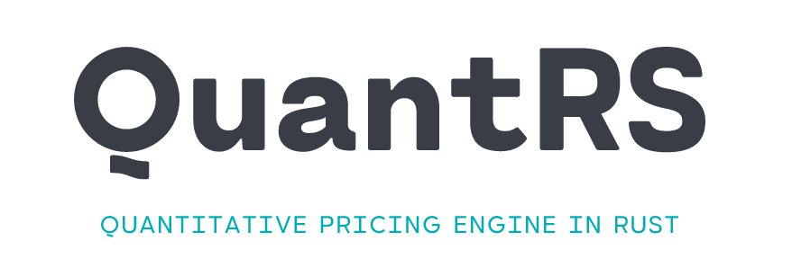

<!-- PROJECT SHIELDS -->
<!--
*** I'm using markdown "reference style" links for readability.
*** Reference links are enclosed in brackets [ ] instead of parentheses ( ).
*** See the bottom of this document for the declaration of the reference variables
*** for contributors-url, forks-url, etc. This is an optional, concise syntax you may use.
*** https://www.markdownguide.org/basic-syntax/#reference-style-links

[![LinkedIn][linkedin-shield]][linkedin-url]
-->
[![Contributors][contributors-shield]][contributors-url]
[![Forks][forks-shield]][forks-url]
[![Stargazers][stars-shield]][stars-url]
[![Issues][issues-shield]][issues-url]
[![MIT License][license-shield]][license-url]

<!-- PROJECT LOGO -->
 

  

<h3 align="center">QuantRS</h3>

  

    An implementation of QuantLib with Rust. 
     
     
    <a href="https://github.com/zachgenius/QuantRS/issues">Report Bug</a>
    ·
    <a href="https://github.com/zachgenius/QuantRS/issues">Request Feature</a>
  

<!-- TABLE OF CONTENTS -->

  
Table of Contents

  <ol>
    <li>
      <a href="#about-the-project">About The Project</a>
      <ul>
        <li><a href="#built-with">Built With</a></li>
      </ul>
    </li>
    <li>
      <a href="#getting-started">Getting Started</a>
      <ul>
        <li><a href="#prerequisites">Prerequisites</a></li>
        <li><a href="#installation">Installation</a></li>
      </ul>
    </li>
    <li><a href="#usage">Usage</a></li>
    <li><a href="#roadmap">Roadmap</a></li>
    <li><a href="#contributing">Contributing</a></li>
    <li><a href="#license">License</a></li>
    <li><a href="#contact">Contact</a></li>
    <li><a href="#acknowledgments">Acknowledgments</a></li>
  </ol>

<!-- ABOUT THE PROJECT -->
## About The Project

This project is in a very early stage. I'll try my best to implement all features of [QuantLib](https://github.com/lballabio/QuantLib)

(<a href="#readme-top">back to top</a>)

### Built With

* [![Rust][Rustlang]][Rust-url]

(<a href="#readme-top">back to top</a>)

<!-- GETTING STARTED -->
## Getting Started

TODO

### Prerequisites

Follow the [Rust Official Docs](https://www.rust-lang.org/learn/get-started) to install the Rust language and `cargo`.

<!-- ROADMAP -->
## Roadmap

- [ ] Feature 1
- [ ] Feature 2
- [ ] Feature 3
    - [ ] Nested Feature

See the [open issues](https://github.com/zachgenius/QuantRS/issues) for a full list of proposed features (and known issues).

(<a href="#readme-top">back to top</a>)

<!-- CONTRIBUTING -->
## Contributing

Contributions are what make the open source community such an amazing place to learn, inspire, and create. Any contributions you make are **greatly appreciated**.

If you have a suggestion that would make this better, please fork the repo and create a pull request. You can also simply open an issue with the tag "enhancement".
Don't forget to give the project a star! Thanks again!

1. Fork the Project
2. Create your Feature Branch (`git checkout -b feature/AmazingFeature`)
3. Commit your Changes (`git commit -m 'Add some AmazingFeature'`)
4. Push to the Branch (`git push origin feature/AmazingFeature`)
5. Open a Pull Request

(<a href="#readme-top">back to top</a>)

<!-- LICENSE -->
## License

Distributed under the GPL-3.0 License. See `LICENSE.txt` for more information.

(<a href="#readme-top">back to top</a>)

<!-- CONTACT -->
## Contact

Project Link: [https://github.com/zachgenius/QuantRS](https://github.com/zachgenius/QuantRS)

(<a href="#readme-top">back to top</a>)

<!-- ACKNOWLEDGMENTS -->
## Acknowledgments

* [QuantLib](https://www.quantlib.org)

(<a href="#readme-top">back to top</a>)

<!-- MARKDOWN LINKS & IMAGES -->
<!-- https://www.markdownguide.org/basic-syntax/#reference-style-links -->
[contributors-shield]: https://img.shields.io/github/contributors/zachgenius/QuantRS.svg?style=for-the-badge
[contributors-url]: https://github.com/zachgenius/QuantRS/graphs/contributors
[forks-shield]: https://img.shields.io/github/forks/zachgenius/QuantRS.svg?style=for-the-badge
[forks-url]: https://github.com/zachgenius/QuantRS/network/members
[stars-shield]: https://img.shields.io/github/stars/zachgenius/QuantRS.svg?style=for-the-badge
[stars-url]: https://github.com/zachgenius/QuantRS/stargazers
[issues-shield]: https://img.shields.io/github/issues/zachgenius/QuantRS.svg?style=for-the-badge
[issues-url]: https://github.com/zachgenius/QuantRS/issues
[license-shield]: https://img.shields.io/github/license/zachgenius/QuantRS.svg?style=for-the-badge
[license-url]: https://github.com/zachgenius/QuantRS/blob/master/LICENSE.txt
[product-screenshot]: media/screenshot.png
[Rustlang]: https://img.shields.io/badge/Rust-FFFFFF?style=for-the-badge&logo=rust&logoColor=black
[Rust-url]: https://www.rust-lang.org/

